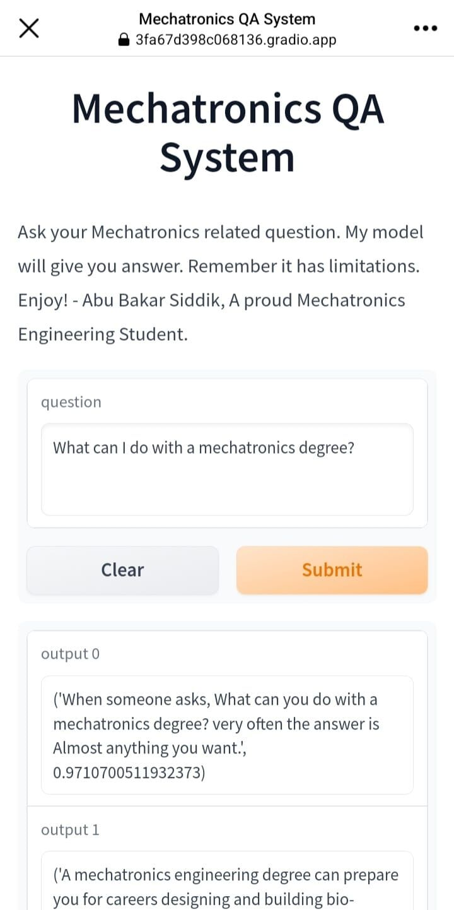
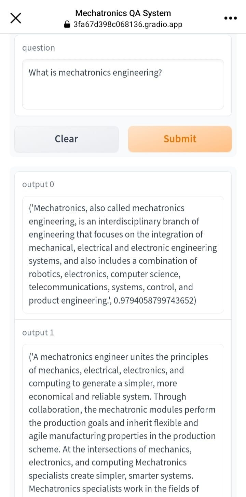

# Mechatronics Engineering QA System

### [HuggingFace Space](https://huggingface.co/spaces/Bakar31/MTE_QA)

## Overview:

Mechatronics Engineering is a relatively unfamiliar field to most people. Whenever I tell someone I study Mechatronics Engineering, almost always they ask, "What is that?" Most people have never heard of it. So, it's a common problem. To address this problem, I have created a question-answering system that will answer your Mechatronics related queries. **However, the system has limitations that need to be considered.**.

**Note:** You can look at the example questions I provided on GitHub. You'll also find the raw data I scraped from Google, as well as all the codes. I didn't have much time to create a big dataset, but it was good enough for basic QA. The system returns two possible answers with its confidence score.

## Objectives:

- The main objective of this project was to develop a question-answering system that can answer simple queries related to Mechatronics Engineering.
- The aim was to create a useful tool that could provide quick and accurate answers to common questions asked by individuals unfamiliar with the field.

## My Approch:

### Data Collection & Dataset Creation:

The first step was to collect raw data from Google related to Mechatronics Engineering. Once the data was collected, I created a dataset that would be used to train the question-answering model using data annotation tool. Although the dataset was not extensive, it contained enough information to address simple questions.

### Model Training:

To train the model, Haystack framework was used. It is an open-source framework that simplifies the process of building question-answering models. The Deepset **roberta-base-squad2** model was the most effective among several models tested. The following settings were used during training: 

- max_seq_len = 512,
- context_window_size = 150,
- doc_stride = 128,
- batch_size = 32

### Frontend Development:

To provide an interface for the system, gradio was used. It an open-source library that allows developers to quickly create customizable interfaces for their machine learning models.

### Output Generation:

The question-answering system returns two possible answers along with their corresponding confidence scores. This enables the user to evaluate the quality of the answer and select the most suitable one.

Sample output:  
 

## Conclusion

This project aims to develop a question-answering system that can answer simple queries related to Mechatronics Engineering. Although the dataset was not extensive, the system is effective for answering basic queries related to the field. This project shows that using question-answering systems can be a useful tool in providing quick and accurate answers to questions related to specific fields.

Demo questions:
- what is mechatronics engineering?
- what is the origin of mechatronics?'
- why persue mechatronics engineering? 
- What is a good example of a mechatronics system?
- What does a mechatronics engineer do?
- Salary of a mechatronics engineer?
- Is a mechatronics engineer worth hiring? 
- What does a mechatronics specialist do?
- Is there the connection between Iot and mechatronics?
- Job sector for mechatronics engineers?  
- Career opputunities for a mechatronics engineer?
- How are mechatronics engineers changing the world? 
- Job responsibilities of a mechatronics engineer?
- job sectors for mechatronics engineers? 
- what are some examples of mechatronics products?
- What is the salary of a robotic expert?
- What can I do after completing a degree in mechatronics?
- why should I hire a mechatronics engineer?
- what is the best university in bangladesh for mechatronics degree?
- Mechatronics engineering in Bangladesh?
- what are the roles of mechatronics in healthcare?
- What does a mechatronics engineer do in the medical field?
- What are the roles of mechatronics engineers in an industry? 
- Is a mechatronics engineer suited for the defense industry?
- Is a mechatronics engineer suited for the telecom industry?
- What are the applications of mechatronics in automobiles
